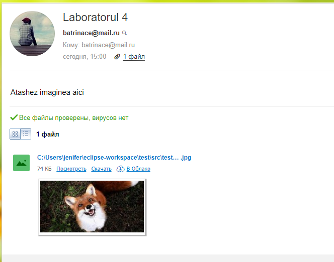

# Protocoale postei electronic

Serverul utilizat `SMTP`-este un protocol de rețea utilizat pe scară largă, conceput pentru trimiterea de e-mail prin rețelele TCP / IP.

Rezulatul obtinu:
<p> </p>

La instalarea a doua librarii am putut pe lar utiliza diferite functii care au permis indeplinirea sarcinii propuse
``````


			
	
		
		
		
			
			
    
 
      
